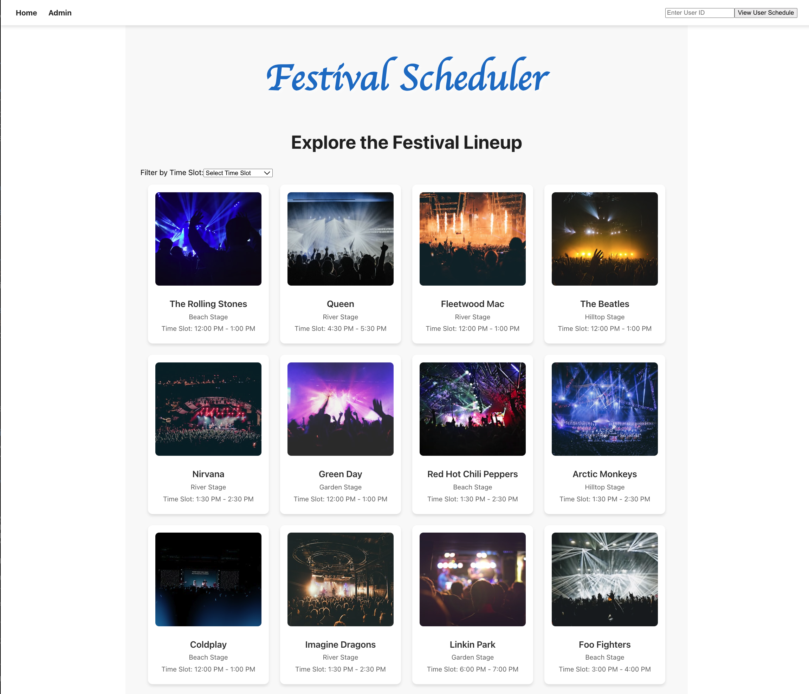
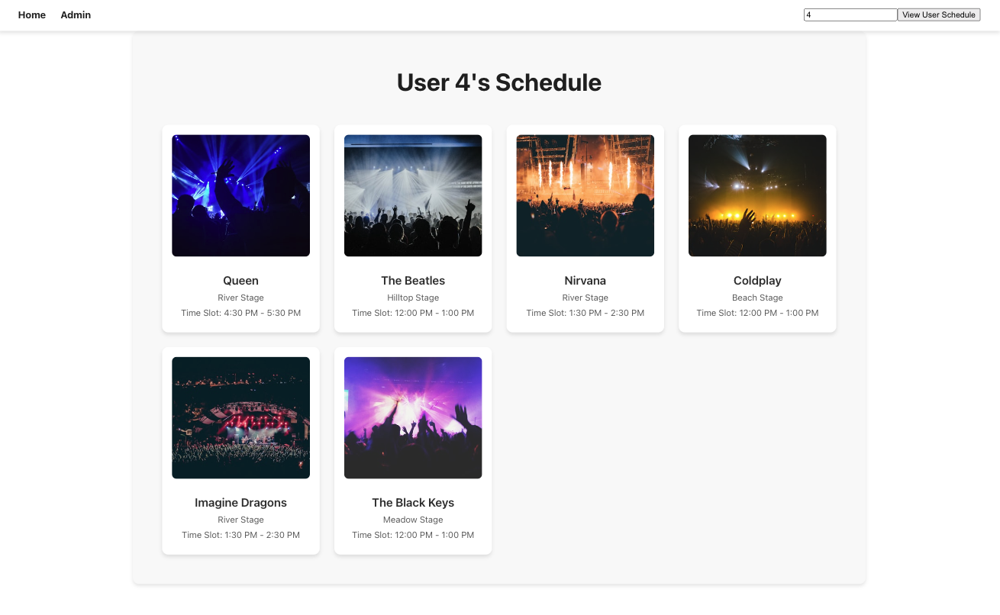
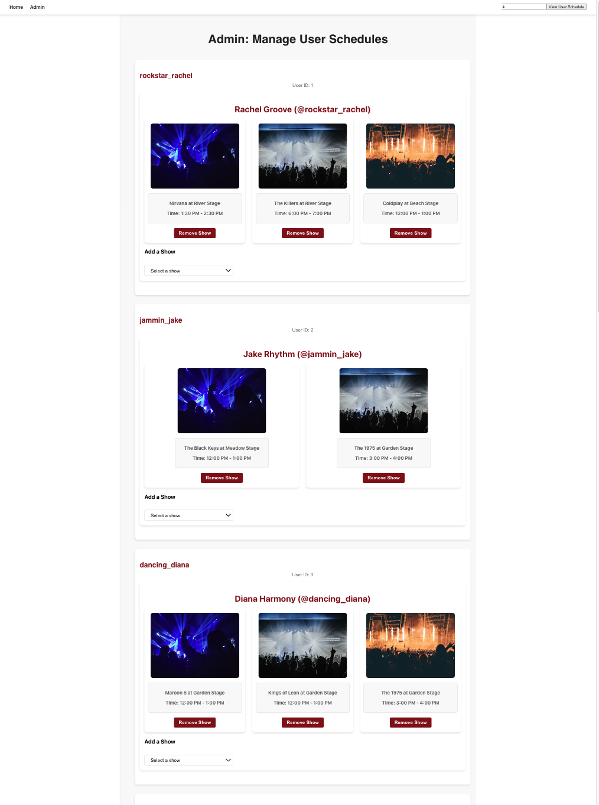

# 🎵 Festival Scheduler - Frontend

A dynamic, whimsical React application that allows music festival administrators to explore festival shows and manage user schedules.

**This solo project was fully created in under 16 hours, including the back end, as part of a take-home challenge**
---

## 🚀 Summary

The **Festival Scheduler** is designed to provide an interactive experience for festival administrators to:
- Explore the festival lineup.
- Filter shows by time slot.
- Create and manage personalized schedules, including adding and deleting specific shows.
- View a specific user's festival schedule.

---

## 📸 Walkthrough

### Homepage
  
Explore the festival lineup with a whimsical, responsive layout.

### User Schedule
  
Users can view and manage their personal schedules with intuitive options to add or remove shows.

### Admin Page
  
Admins can oversee all user schedules and manage show assignments.

---

## 🛠️ Setup Instructions

Follow these steps to get the front-end up and running:

### Prerequisites
- Node.js (v14+)
- npm or yarn

### Installation
1. Clone the repository:
   ```bash
   git clone https://github.com/your-repo/festival-scheduler-frontend.git

   ```
2. Navigate to the project directory:
   ```bash
   cd festival-scheduler-frontend
   ```
3. Install dependencies:
   ```bash
   npm install
   ```
   Or, if you use yarn:
   ```bash
   yarn install
   ```

### Starting the Application
1. Run the app:
   ```bash
   npm start
   ```
   Or, using yarn:
   ```bash
   yarn start
   ```
2. Open your browser and navigate to `http://localhost:3001`.

---

## 🌐 API Endpoints Used

This frontend connects to the **Rails API backend**. Below are the endpoints utilized:

### **Unsplash API**
1. **Fetch random images**  
   Endpoint: `https://api.unsplash.com/search/photos`  
   Method: `GET`  
   Parameters:
   - `query`: Search term for images (e.g., "concert").
   - `per_page`: Number of images to fetch.
   - `client_id`: Your Unsplash API access key.

### **Rails API**
1. **Fetch all shows**  
   Endpoint: `GET /api/v1/shows`  
   Returns a list of all festival shows.

2. **Fetch a user's schedule**  
   Endpoint: `GET /api/v1/users/:user_id/shows`  
   Retrieves all shows associated with a specific user.

3. **Add a show to a user's schedule**  
   Endpoint: `POST /api/v1/users/:user_id/shows`  
   Request body:
   ```json
   {
     "show_id": 1
   }
   ```
   Adds the specified show to the user's schedule.

4. **Remove a show from a user's schedule**  
   Endpoint: `DELETE /api/v1/users/:user_id/shows/:show_id`  
   Removes the specified show from the user's schedule.

5. **Fetch all user schedules (Admin)**  
   Endpoint: `GET /api/v1/users/shows`  
   Returns all users and their associated schedules.

---

## 📝 Instructions for Use

1. **Explore Shows**:
   - Navigate to the homepage to view the lineup.
   - Filter shows by time slots using the dropdown menu.

2. **Manage Schedules**:
   - Visit `/user/:user_id` to view and manage your schedule.
   - Add or remove shows dynamically.

3. **Administer User Schedules**:
   - Navigate to `/admin` to view all user schedules.
   - Admins can manage individual user schedules directly.

---

## 🛠 Features and Design Decisions

1. **Dynamic Filtering**:
   - Users can filter shows by time slots, providing a tailored experience.
2. **Responsive Design**:
   - Built with a grid-based layout for consistency across devices.
3. **Whimsical Theme**:
   - Used playful fonts and vibrant colors to match the festival theme.
4. **Error Handling**:
   - Ensures smooth navigation even during API failures.
5. **Clean Codebase**:
   - Modularized components for maintainability and scalability.

---

## 🔧 Tech Stack

- **Frontend**:
  - React (Functional Components, Hooks)
  - CSS (Responsive Design)

- **Backend**:
  - Rails API (Details in backend README)

- **Third-Party Integration**:
  - Unsplash API for dynamic images

---

## 💡 Future Improvements

- **Search Functionality**:
  - Add the ability to search for shows by artist or location.
- **Sorting Options**:
  - Allow sorting by popularity or other criteria.
- **Real-Time Updates**:
  - Implement WebSockets to reflect live schedule changes.

---

## 🔍 Additional Resources

- [Unsplash API Documentation](https://unsplash.com/documentation)
- [React Documentation](https://reactjs.org/docs/getting-started.html)

---
```
